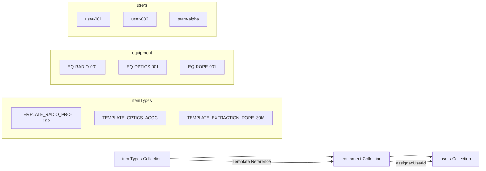

# 🔧 Equipment Collection Documentation

## Overview

The `equipment` collection stores individual equipment items in the Sayeret Givati equipment management system. Each equipment document is based on a template from the `itemTypes` collection and includes specific assignment information, status, and tracking data.

## Purpose

- **Individual Tracking**: Track specific equipment items with unique serial numbers
- **Assignment Management**: Assign equipment to specific users or teams
- **Status Monitoring**: Track equipment status and condition
- **Template-Based**: Leverage itemTypes templates for consistency
- **Visual Documentation**: Store images for each equipment item

## Collection Structure

### Document ID Format

- **Format**: `EQ-{CATEGORY}-{NUMBER}`
- **Examples**:
  - `EQ-RADIO-001`
  - `EQ-OPTICS-001`
  - `EQ-ROPE-001`

### Schema Fields

| Field | Type | Required | Description | Example |
|-------|------|----------|-------------|---------|
| `id` | `string` | ✅ | Unique equipment ID (also document ID) | `"EQ-RADIO-001"` |
| `itemTypeId` | `string` | ✅ | References template from itemTypes collection | `"TEMPLATE_RADIO_PRC-152"` |
| `category` | `string` | ✅ | Equipment category (from template) | `"radio"` |
| `model` | `string` | ✅ | Equipment model (from template) | `"PRC-152"` |
| `manufacturer` | `string` | ✅ | Manufacturer name (from template) | `"Harris"` |
| `assignmentType` | `"team" \| "personal"` | ✅ | Assignment type (from template) | `"team"` |
| `equipmentDepot` | `string` | ✅ | Storage depot (from template or user override) | `"Radio Depot"` |
| `assignedUserId` | `string` | ✅ | User ID of assigned person/team | `"user-001"` |
| `assignedUserName` | `string` | ❌ | Display name of assigned user | `"דני כהן"` |
| `status` | `string` | ✅ | Current status (from template or user override) | `"active"` |
| `registeredAt` | `timestamp` | ✅ | When equipment was registered | `"2024-01-15T10:30:00Z"` |
| `imageUrl` | `string` | ❌ | Firebase Storage URL for item photo | `"https://storage.googleapis.com/..."` |
| `createdAt` | `timestamp` | ❌ | Document creation timestamp (auto-generated) | Auto-set |
| `updatedAt` | `timestamp` | ❌ | Last update timestamp (auto-generated) | Auto-set |

## Sample Data

The system includes 6 sample equipment items based on the itemTypes templates:

### 1. Radio Equipment

```json
{
  "id": "EQ-RADIO-001",
  "itemTypeId": "TEMPLATE_RADIO_PRC-152",
  "category": "radio",
  "model": "PRC-152", 
  "manufacturer": "Harris",
  "assignmentType": "team",
  "equipmentDepot": "Radio Depot",
  "assignedUserId": "user-001",
  "assignedUserName": "דני כהן",
  "status": "active",
  "registeredAt": "2024-01-15T10:30:00Z",
  "imageUrl": "https://storage.googleapis.com/sayeret-givati/equipment/radio-prc152-001.jpg"
}
```

### 2. Optics Equipment  

```json
{
  "id": "EQ-OPTICS-001",
  "itemTypeId": "TEMPLATE_OPTICS_ACOG",
  "category": "optics",
  "model": "ACOG 4x32",
  "manufacturer": "Trijicon", 
  "assignmentType": "personal",
  "equipmentDepot": "Optics Depot",
  "assignedUserId": "user-003",
  "assignedUserName": "מיכאל אברהם",
  "status": "active",
  "registeredAt": "2024-01-15T10:30:00Z",
  "imageUrl": "https://storage.googleapis.com/sayeret-givati/equipment/acog-001.jpg"
}
```

### 3. Extraction Gear (with depot override)

```json
{
  "id": "EQ-ROPE-002", 
  "itemTypeId": "TEMPLATE_EXTRACTION_ROPE_30M",
  "category": "extraction_gear",
  "model": "Rescue Rope 30m",
  "manufacturer": "Petzl",
  "assignmentType": "team",
  "equipmentDepot": "Advanced Gear Depot",  // Override from template
  "assignedUserId": "team-bravo",
  "assignedUserName": "כיתה בראבו", 
  "status": "maintenance",  // Override from template
  "registeredAt": "2024-01-15T10:30:00Z",
  "imageUrl": "https://storage.googleapis.com/sayeret-givati/equipment/rope-30m-002.jpg"
}
```

## Implementation Files

### 1. Schema Definition

- **File**: `src/types/equipment.ts`
- **Contains**: `Equipment` interface, legacy interfaces for backward compatibility

### 2. Service Layer  

- **File**: `src/lib/equipmentService.ts`
- **Contains**: `EquipmentService` class with full CRUD operations

### 3. Seeding Script

- **File**: `src/scripts/seedEquipment.ts`
- **Contains**: Script to populate collection with sample data

### 4. Admin Component

- **File**: `src/components/admin/EquipmentSeeder.tsx`
- **Contains**: UI component for managing equipment collection

### 5. Configuration

- **File**: `src/constants/admin.ts`
- **Contains**: `FIRESTORE_EQUIPMENT_COLLECTION` constant

### 6. Security Rules

- **File**: `firestore.rules`
- **Contains**: Updated security rules for equipment collection

## Usage

### 1. Seeding the Collection

#### Option A: Using the Script

```bash
npx ts-node src/scripts/seedEquipment.ts
```

#### Option B: Using the Service

```typescript
import { EquipmentService } from '@/lib/equipmentService';

await EquipmentService.seedEquipment();
```

#### Option C: Using the Admin UI

Navigate to the admin panel and use the EquipmentSeeder component.

### 2. Creating Equipment

```typescript
import { EquipmentService } from '@/lib/equipmentService';

const equipmentData = {
  id: 'EQ-RADIO-003',
  itemTypeId: 'TEMPLATE_RADIO_PRC-152',
  assignedUserId: 'user-005',
  assignedUserName: 'רונן שמיר',
  status: 'active',
  imageUrl: 'https://storage.googleapis.com/sayeret-givati/equipment/radio-003.jpg'
};

const result = await EquipmentService.createEquipment(equipmentData);
```

### 3. Querying Equipment

```typescript
import { EquipmentService } from '@/lib/equipmentService';

// Get all equipment
const allEquipment = await EquipmentService.getAllEquipment();

// Get equipment by user
const userEquipment = await EquipmentService.getEquipmentByUserId('user-001');

// Get equipment by category  
const radios = await EquipmentService.getEquipmentByCategory('radio');

// Get equipment by assignment type
const personalItems = await EquipmentService.getEquipmentByAssignmentType('personal');
```

### 4. Updating Equipment

```typescript
import { EquipmentService } from '@/lib/equipmentService';

// Update status
await EquipmentService.updateEquipmentStatus('EQ-RADIO-001', 'maintenance');

// Transfer equipment
await EquipmentService.transferEquipment('EQ-RADIO-001', 'user-002', 'יוסי לוי');
```

## Template Integration

Equipment items are created based on itemTypes templates:

1. **Template Selection**: Choose an itemType template (e.g., `TEMPLATE_RADIO_PRC-152`)
2. **Field Population**: Core fields (category, model, manufacturer, etc.) are populated from template
3. **Assignment Specifics**: Add unique ID, assigned user, and optionally override depot/status
4. **Image Assignment**: Add specific image URL for this equipment instance

## Security

### Firestore Rules

- **Read**: All authenticated users can read equipment
- **Create**: Authenticated users with proper validation
- **Update**: Authenticated users with field validation (core template fields cannot be changed)
- **Delete**: Only test documents (`TEST-*` or `DEBUG-*` prefixes)

### Validation Rules

- Required fields must be present
- Core template fields (category, model, manufacturer) cannot be changed after creation
- Assignment type must be 'team' or 'personal'
- Item type ID cannot be changed after creation

## Data Relationships



## Assignment Types

### Personal Assignment

- **Type**: `"personal"`
- **Usage**: Individual soldier equipment (optics, personal weapons)
- **Assignment**: Specific user ID
- **Responsibility**: Individual accountability

### Team Assignment  

- **Type**: `"team"`
- **Usage**: Shared team equipment (radios, ropes, heavy gear)
- **Assignment**: Team/unit ID
- **Responsibility**: Team collective accountability

## Status Management

Common status values:

- `active` - Equipment in active use
- `maintenance` - Under maintenance/repair
- `storage` - In storage/not assigned
- `lost` - Equipment is missing
- `broken` - Equipment is damaged/non-functional
- `retired` - Equipment retired from service

## Testing

Run the test suite:

```bash
npm test -- src/lib/__tests__/equipmentService.test.ts
```

The tests cover:

- Sample data validation
- Equipment creation with templates
- Service method functionality
- Error handling scenarios
- Status and transfer operations

## Best Practices

1. **ID Convention**: Use consistent naming pattern `EQ-{CATEGORY}-{NUMBER}`
2. **Template Usage**: Always create equipment from valid itemTypes templates
3. **Assignment Tracking**: Keep assignedUserName updated for display purposes
4. **Image Management**: Use Firebase Storage URLs for equipment photos
5. **Status Updates**: Regularly update equipment status
6. **Depot Overrides**: Use sparingly - only when different from template default
7. **Testing**: Use `TEST-` prefix for development/testing items

## Error Handling

The service includes comprehensive error handling:

- **Validation Errors**: Missing required fields
- **Template Not Found**: Invalid itemTypeId references
- **Network Errors**: Firestore connection issues
- **Permission Errors**: Insufficient user permissions
- **Constraint Violations**: Security rule violations

## Performance Considerations

- **Batch Operations**: Use batch writes for bulk operations
- **Indexed Queries**: Queries by assignedUserId, category, and assignmentType are indexed
- **Pagination**: Consider pagination for large equipment lists
- **Image Optimization**: Optimize image sizes for faster loading

## Future Enhancements

- **Maintenance Schedules**: Add maintenance tracking
- **Location Tracking**: GPS/RFID integration
- **QR Codes**: Generate QR codes for equipment identification
- **History Tracking**: Detailed transfer and status change history
- **Cost Tracking**: Equipment value and depreciation
- **Warranty Management**: Warranty expiration tracking
- **Analytics**: Equipment utilization and performance metrics
