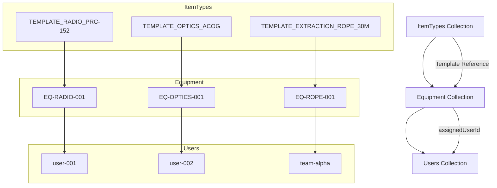

# 📋 Equipment System Schema & Workflow Documentation

## Overview

This document provides comprehensive documentation for the Sayeret Givati equipment management system, including detailed schema definitions and step-by-step workflows for managing equipment and templates.

## 🏗️ Database Schema

### ItemTypes Collection Schema

The `itemTypes` collection contains equipment templates that serve as blueprints for creating individual equipment items.

#### Document Structure

| Field | Type | Required | Description | Example |
|-------|------|----------|-------------|---------|
| `id` | `string` | ✅ | Unique template identifier (also document ID) | `"TEMPLATE_RADIO_PRC-152"` |
| `category` | `string` | ✅ | Equipment category | `"radio"` |
| `model` | `string` | ✅ | Equipment model name | `"PRC-152"` |
| `manufacturer` | `string` | ✅ | Manufacturer name | `"Harris"` |
| `assignmentType` | `'team' \| 'personal'` | ✅ | Assignment type | `"team"` |
| `defaultDepot` | `string` | ✅ | Default storage depot | `"Radio Depot"` |
| `defaultImageUrl` | `string` | ❌ | Optional default image URL | `"https://storage.googleapis.com/..."` |
| `defaultStatus` | `string` | ✅ | Default status for new items | `"work"` |
| `createdAt` | `timestamp` | ❌ | Creation timestamp (auto-generated) | `2024-01-15T10:30:00Z` |
| `updatedAt` | `timestamp` | ❌ | Last update timestamp (auto-generated) | `2024-01-15T10:30:00Z` |

#### Field Validation Rules

- **`id`**: Must be a non-empty string, typically follows pattern `TEMPLATE_{CATEGORY}_{MODEL}`
- **`category`**: Must be a non-empty string from predefined categories
- **`model`**: Must be a non-empty string describing the equipment model
- **`manufacturer`**: Must be a non-empty string with manufacturer name
- **`assignmentType`**: Must be exactly `"team"` or `"personal"`
- **`defaultDepot`**: Must be a non-empty string naming the storage location
- **`defaultStatus`**: Must be a non-empty string indicating initial status

#### Predefined Categories

```typescript
enum EquipmentCategory {
  RADIO = 'radio',
  OPTICS = 'optics',
  EXTRACTION_GEAR = 'extraction_gear',
  WEAPONS = 'weapons',
  PROTECTIVE_GEAR = 'protective_gear',
  COMMUNICATION = 'communication',
  NAVIGATION = 'navigation',
  MEDICAL = 'medical',
  TOOLS = 'tools',
  GENERAL = 'general'
}
```

#### Sample ItemType Document

```json
{
  "id": "TEMPLATE_RADIO_PRC-152",
  "category": "radio",
  "model": "PRC-152",
  "manufacturer": "Harris",
  "assignmentType": "team",
  "defaultDepot": "Radio Depot",
  "defaultImageUrl": "https://storage.googleapis.com/sayeret-givati/templates/radio-prc152.jpg",
  "defaultStatus": "work",
  "createdAt": "2024-01-15T10:30:00Z",
  "updatedAt": "2024-01-15T10:30:00Z"
}
```

### Equipment Collection Schema

The `equipment` collection contains individual equipment items based on itemTypes templates.

#### Document Structure

| Field | Type | Required | Description | Example |
|-------|------|----------|-------------|---------|
| `id` | `string` | ✅ | Unique equipment identifier (also document ID) | `"EQ-RADIO-001"` |
| `itemTypeId` | `string` | ✅ | Reference to itemTypes template | `"TEMPLATE_RADIO_PRC-152"` |
| `category` | `string` | ✅ | Equipment category (from template) | `"radio"` |
| `model` | `string` | ✅ | Equipment model (from template) | `"PRC-152"` |
| `manufacturer` | `string` | ✅ | Manufacturer name (from template) | `"Harris"` |
| `assignmentType` | `'team' \| 'personal'` | ✅ | Assignment type (from template) | `"team"` |
| `equipmentDepot` | `string` | ✅ | Storage depot (from template or override) | `"Radio Depot"` |
| `assignedUserId` | `string` | ✅ | User ID of assigned person/team | `"user-001"` |
| `assignedUserName` | `string` | ❌ | Display name of assigned user | `"דני כהן"` |
| `status` | `string` | ✅ | Current status (from template or override) | `"active"` |
| `registeredAt` | `timestamp` | ✅ | Equipment registration timestamp | `2024-01-15T10:30:00Z` |
| `imageUrl` | `string` | ❌ | Firebase Storage URL for item photo | `"https://storage.googleapis.com/..."` |
| `createdAt` | `timestamp` | ❌ | Document creation timestamp (auto-generated) | `2024-01-15T10:30:00Z` |
| `updatedAt` | `timestamp` | ❌ | Last update timestamp (auto-generated) | `2024-01-15T10:30:00Z` |

#### Field Validation Rules

- **`id`**: Must be a non-empty string, typically follows pattern `EQ-{CATEGORY}-{NUMBER}`
- **`itemTypeId`**: Must be a non-empty string referencing existing itemTypes document
- **`category`**: Must be a non-empty string (inherited from template, immutable)
- **`model`**: Must be a non-empty string (inherited from template, immutable)
- **`manufacturer`**: Must be a non-empty string (inherited from template, immutable)
- **`assignmentType`**: Must be exactly `"team"` or `"personal"` (inherited from template, immutable)
- **`equipmentDepot`**: Must be a non-empty string (can override template default)
- **`assignedUserId`**: Must be a non-empty string identifying the assigned person/team
- **`status`**: Must be a non-empty string indicating current equipment status
- **`registeredAt`**: Must be a valid timestamp when equipment was first registered

#### Common Status Values

- `"active"` - Equipment in active use
- `"maintenance"` - Under maintenance/repair
- `"storage"` - In storage/not assigned
- `"work"` - Working condition, ready for use
- `"available"` - Available for assignment
- `"lost"` - Equipment is missing
- `"broken"` - Equipment is damaged/non-functional
- `"retired"` - Equipment retired from service

#### Sample Equipment Document

```json
{
  "id": "EQ-RADIO-001",
  "itemTypeId": "TEMPLATE_RADIO_PRC-152",
  "category": "radio",
  "model": "PRC-152",
  "manufacturer": "Harris",
  "assignmentType": "team",
  "equipmentDepot": "Radio Depot",
  "assignedUserId": "user-001",
  "assignedUserName": "דני כהן",
  "status": "active",
  "registeredAt": "2024-01-15T10:30:00Z",
  "imageUrl": "https://storage.googleapis.com/sayeret-givati/equipment/radio-prc152-001.jpg",
  "createdAt": "2024-01-15T10:30:00Z",
  "updatedAt": "2024-01-15T10:30:00Z"
}
```

## 🔄 Equipment Management Workflow

### Process 1: Adding New Equipment Using Templates

This is the primary workflow for creating new equipment items based on existing templates.

#### Step 1: Access Equipment Management

1. Navigate to Equipment page in the application
2. Click on the "Add Equipment" tab
3. Ensure user has appropriate permissions (`equipment_manager`, `commander`, or `admin`)

#### Step 2: Select Equipment Template

1. **Template Display**: System fetches all available templates from `itemTypes` collection
2. **Category Grouping**: Templates are organized by category (radio, optics, etc.)
3. **Template Selection**: User clicks on desired template
4. **Template Preview**: System displays template details:
   - Category, model, manufacturer
   - Assignment type (team/personal)
   - Default depot and status

#### Step 3: Fill Equipment Details

1. **Auto-Population**: Form auto-fills with template data:
   - Category (read-only, from template)
   - Model (read-only, from template)
   - Manufacturer (read-only, from template)
   - Assignment type (read-only, from template)
   - Equipment depot (editable, defaults from template)
   - Status (editable, defaults from template)

2. **Required User Input**:
   - **Equipment ID**: Auto-suggested as `EQ-{CATEGORY}-{TIMESTAMP}`, editable
   - **Assigned User ID**: Required field for assignment
   - **Assigned User Name**: Optional display name
   - **Image URL**: Optional equipment photo

3. **Field Validation**:
   - Equipment ID must be unique and non-empty
   - Assigned User ID must be non-empty
   - Depot and status must be non-empty strings

#### Step 4: Submit and Create

1. **Validation**: System validates all required fields
2. **Template Resolution**: System fetches template data to populate inherited fields
3. **Document Creation**: New equipment document created in Firestore with:
   - All template fields copied over
   - User-specific fields added
   - Timestamps auto-generated
4. **Success Feedback**: User receives confirmation with equipment ID
5. **List Refresh**: Equipment list updates to show new item

#### Code Example: Equipment Creation Process

```typescript
// 1. User selects template
const selectedTemplate = await ItemTypesService.getById('TEMPLATE_RADIO_PRC-152');

// 2. Form pre-filled with template data
const formData = {
  itemTypeId: selectedTemplate.id,
  equipmentDepot: selectedTemplate.defaultDepot,
  status: selectedTemplate.defaultStatus,
  // User fills these:
  id: 'EQ-RADIO-003',
  assignedUserId: 'user-005',
  assignedUserName: 'רונן שמיר'
};

// 3. Equipment created with full schema
const equipment = await EquipmentService.createEquipment(formData);
```

### Process 2: Equipment Status Management

#### Updating Equipment Status

1. **Access**: Navigate to equipment list
2. **Selection**: Find and select equipment item
3. **Status Change**: Update status field
4. **Validation**: Ensure valid status value
5. **Save**: Persist changes to Firestore

#### Transferring Equipment

1. **Access**: Navigate to equipment details
2. **Transfer**: Update `assignedUserId` and `assignedUserName`
3. **Validation**: Ensure valid user assignment
4. **History**: Track transfer in audit logs
5. **Notification**: Notify relevant parties

## 🏗️ Template Management Workflow

### Process 1: Adding New Equipment Templates

This workflow allows authorized users to create new equipment templates for future use.

#### Step 1: Access Template Management

1. Navigate to Admin panel
2. Access ItemTypes management section
3. Ensure user has template management permissions (`equipment_manager`, `commander`, or `admin`)

#### Step 2: Create New Template

1. **Template Form**: Fill out new template form with:
   - **Template ID**: Unique identifier (e.g., `TEMPLATE_WEAPON_M4A1`)
   - **Category**: Select from predefined categories
   - **Model**: Equipment model name
   - **Manufacturer**: Manufacturer name
   - **Assignment Type**: Team or personal assignment
   - **Default Depot**: Default storage location
   - **Default Status**: Default status for new items
   - **Default Image URL**: Optional template image

2. **Validation**: System validates:
   - All required fields are present
   - Template ID is unique
   - Category is from approved list
   - Assignment type is valid

#### Step 3: Save Template

1. **Document Creation**: New template saved to `itemTypes` collection
2. **Availability**: Template immediately available for equipment creation
3. **Success Feedback**: Confirmation of template creation

#### Code Example: Template Creation

```typescript
const newTemplate = {
  id: 'TEMPLATE_WEAPON_M4A1',
  category: 'weapons',
  model: 'M4A1 Carbine',
  manufacturer: 'Colt',
  assignmentType: 'personal',
  defaultDepot: 'Armory',
  defaultStatus: 'work',
  defaultImageUrl: 'https://storage.googleapis.com/sayeret-givati/templates/m4a1.jpg'
};

await ItemTypesService.addItemType(newTemplate);
```

### Process 2: Editing Existing Templates

#### Step 1: Access Template for Editing

1. Navigate to template management
2. Select existing template from list
3. Click edit option

#### Step 2: Modify Template Data

1. **Editable Fields**:
   - Model name
   - Manufacturer
   - Default depot
   - Default status
   - Default image URL

2. **Immutable Fields** (cannot be changed):
   - Template ID
   - Category
   - Assignment type
   - Creation timestamp

#### Step 3: Save Changes

1. **Validation**: Ensure all required fields remain valid
2. **Update**: Save changes to Firestore
3. **Impact**: Changes affect future equipment creation only
4. **Existing Equipment**: Existing equipment items remain unchanged

#### Step 4: Template Versioning (Future Enhancement)

1. **Version Control**: Track template changes over time
2. **Migration**: Handle equipment created from older template versions
3. **Audit Trail**: Maintain history of template modifications

### Process 3: Template Categories Management

#### Adding New Categories

1. **Code Update**: Add new category to `EquipmentCategory` enum
2. **UI Update**: Update category selection in forms
3. **Icons**: Add appropriate category icons
4. **Validation**: Update validation rules
5. **Documentation**: Update category documentation

#### Category Structure Example

```typescript
// Add new category to enum
enum EquipmentCategory {
  // ... existing categories
  VEHICLES = 'vehicles',
  ELECTRONICS = 'electronics'
}

// Update icon mapping
const categoryIcons = {
  // ... existing icons
  vehicles: '🚗',
  electronics: '⚡'
};
```

## 🔐 Permission Requirements

### Equipment Operations

| Operation | Required Role | Notes |
|-----------|---------------|-------|
| View Equipment | `soldier`, `officer`, `equipment_manager`, `commander`, `admin` | All authenticated users |
| Create Equipment | `equipment_manager`, `commander`, `admin` | Management roles only |
| Update Equipment | `equipment_manager`, `commander`, `admin` | Management roles only |
| Delete Equipment | `equipment_manager`, `commander`, `admin` | Test documents only |

### Template Operations

| Operation | Required Role | Notes |
|-----------|---------------|-------|
| View Templates | `soldier`, `officer`, `equipment_manager`, `commander`, `admin` | All authenticated users |
| Create Templates | `equipment_manager`, `commander`, `admin` | Management roles only |
| Update Templates | `equipment_manager`, `commander`, `admin` | Management roles only |
| Delete Templates | `equipment_manager`, `commander`, `admin` | Test documents only |

## 📊 Data Relationships



## 🚀 Performance Considerations

### Query Optimization

- **Indexed Fields**: All common query fields are indexed
- **Composite Queries**: Complex filters use composite indexes
- **Pagination**: Large result sets use cursor-based pagination

### Caching Strategy

- **Template Caching**: Frequently used templates cached in application
- **Category Lists**: Category enums cached for quick access
- **User Permissions**: Role-based permissions cached per session

### Scalability

- **Horizontal Scaling**: Firestore automatically scales with usage
- **Regional Replication**: Data replicated across regions for availability
- **Backup Strategy**: Regular automated backups of all collections

## 🔧 Technical Implementation

### Key Services

- **ItemTypesService**: Manages template CRUD operations
- **EquipmentService**: Manages equipment CRUD operations
- **ValidationUtils**: Handles data validation
- **SecurityUtils**: Manages permissions and access control

### UI Components

- **AddEquipmentForm**: Template-based equipment creation
- **TemplateSelector**: Template selection interface
- **EquipmentSeeder**: Admin equipment management
- **ItemTypesSeeder**: Admin template management

### Data Flow

1. User selects template → Template data fetched
2. Form pre-populated → User adds specific details
3. Validation → Security rules enforced
4. Document creation → Firestore persistence
5. Success feedback → UI updates

This comprehensive schema and workflow documentation ensures all team members understand how to effectively use the equipment management system and maintain data integrity throughout all operations.
