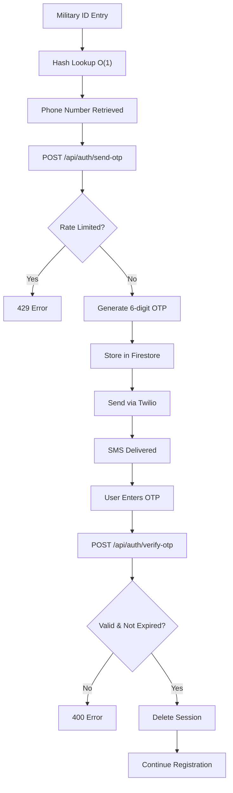

# 📱 OTP Implementation - Steps 3 & 4 Complete Guide

## 🎯 Step 3: Send OTP via Twilio with MESSAGING_SERVICE_SID

### ✅ Implementation Complete

**Location**: `src/lib/twilioService.ts` + `/api/auth/send-otp`

**Key Features**:

- ✅ Uses `MESSAGING_SERVICE_SID` from environment variables
- ✅ Sends Hebrew SMS messages
- ✅ Validates phone numbers (E.164 format)
- ✅ Handles Twilio API errors gracefully
- ✅ Rate limiting (5 per hour per phone number)

### 📤 How Step 3 Works

1. **User triggers OTP send** (after military ID verification)
2. **Phone number validation** using `TwilioService.validatePhoneNumber()`
3. **Rate limit check** using `OTPManager.checkRateLimit()`
4. **OTP generation** using `OTPManager.generateOTPCode()` (6-digit string)
5. **Firestore storage** with 5-minute expiration
6. **Twilio SMS sending** via Messaging Service

### 📋 Step 3 API Usage

```typescript
// Send OTP Request
const response = await fetch('/api/auth/send-otp', {
  method: 'POST',
  headers: { 'Content-Type': 'application/json' },
  body: JSON.stringify({ 
    phoneNumber: '+972501234567' 
  })
});

// Success Response
{
  "success": true,
  "message": "קוד אימות נשלח בהצלחה",
  "phoneNumber": "+972501234567",
  "attemptsRemaining": 4,
  "expiresInMinutes": 5
}
```

### 📱 SMS Message Format

```ascii
קוד האימות שלך: 123456

קוד זה תקף למשך 5 דקות בלבד.
צה"ל - יחידת סיירת גבעתי
```

---

## 🔍 Step 4: OTP Verification Endpoint

### ✅ Implementation Complete

**Location**: `src/lib/otpUtils.ts` + `/api/auth/verify-otp`

**Key Features**:

- ✅ Validates 6-digit OTP format
- ✅ Looks up by phone number (O(1) Firestore lookup)
- ✅ Checks expiration (5 minutes)
- ✅ One-time use (deletes on success)
- ✅ Hebrew error messages
- ✅ Security: No OTP logging

### 🔍 How Step 4 Works

1. **User submits OTP** with phone number
2. **Input validation** (6-digit format, phone number)
3. **Database lookup** using phone number as document ID
4. **Expiration check** against current timestamp
5. **Code comparison** (exact string match)
6. **Session cleanup** (delete used OTP)
7. **Success response** or specific error message

### 📋 Step 4 API Usage

```typescript
// Verify OTP Request
const response = await fetch('/api/auth/verify-otp', {
  method: 'POST',
  headers: { 'Content-Type': 'application/json' },
  body: JSON.stringify({ 
    phoneNumber: '+972501234567',
    otpCode: '123456'
  })
});

// Success Response
{
  "success": true,
  "message": "קוד האימות אומת בהצלחה",
  "phoneNumber": "+972501234567",
  "verified": true
}

// Error Responses
{
  "success": false,
  "error": "קוד האימות שגוי"        // Wrong code
}
{
  "success": false,
  "error": "קוד האימות פג תוקף"     // Expired
}
{
  "success": false,
  "error": "קוד האימות כבר נוצל"    // Already used
}
```

---

## 🔗 Integration Flow

### Complete Registration Flow with OTP



### Frontend Integration Points

```typescript
// After military ID verification in RegistrationForm.tsx
if (militaryIdVerified) {
  // Phone number already retrieved from authorized_personnel
  // Step 3: Send OTP
  const otpResponse = await fetch('/api/auth/send-otp', {
    method: 'POST',
    headers: { 'Content-Type': 'application/json' },
    body: JSON.stringify({ phoneNumber: userPhoneNumber })
  });
  
  if (otpResponse.ok) {
    // Move to OTP verification step
    updateCurrentStep('otp');
  }
}

// In OTPVerificationStep.tsx - replace the TODO
const handleVerifyOTP = async () => {
  // Step 4: Verify OTP
  const verifyResponse = await fetch('/api/auth/verify-otp', {
    method: 'POST',
    headers: { 'Content-Type': 'application/json' },
    body: JSON.stringify({ 
      phoneNumber: userPhoneNumber,
      otpCode: otpCode 
    })
  });
  
  if (verifyResponse.ok) {
    const data = await verifyResponse.json();
    if (data.success) {
      // OTP verified successfully
      onVerifySuccess();
    }
  }
};
```

---

## 🔧 Environment Setup

### Required Variables

Add to `.env.local`:

```bash
# Twilio Configuration for OTP (Steps 3 & 4)
TWILIO_ACCOUNT_SID=AC123...your_account_sid
TWILIO_AUTH_TOKEN=abc123...your_auth_token
MESSAGING_SERVICE_SID=MG123...your_messaging_service_sid
```

### Getting Twilio Credentials

1. **Sign up** at [Twilio Console](https://console.twilio.com/)
2. **Account SID & Auth Token**: Found on Dashboard
3. **Messaging Service**:
   - Go to Messaging → Services
   - Create new Messaging Service
   - Copy the SID (starts with `MG`)

---

## 🧪 Testing Steps 3 & 4

### Run Validation Tests

```bash
# Run the test script
npm run ts-node src/scripts/testOTPFlow.ts

# Or run unit tests
npm test src/lib/__tests__/otpFlow.test.ts
```

### Manual Testing

1. **Start development server**:

   ```bash
   npm run dev
   ```

2. **Test Step 3** (Send OTP):

   ```bash
   curl -X POST http://localhost:3000/api/auth/send-otp \
     -H "Content-Type: application/json" \
     -d '{"phoneNumber":"+972501234567"}'
   ```

3. **Test Step 4** (Verify OTP):

   ```bash
   curl -X POST http://localhost:3000/api/auth/verify-otp \
     -H "Content-Type: application/json" \
     -d '{"phoneNumber":"+972501234567","otpCode":"123456"}'
   ```

---

## 🔒 Security Features Implemented

### Rate Limiting

- ✅ 5 OTP requests per phone number per hour
- ✅ Automatic reset after 1-hour window
- ✅ Stored in Firestore `otp_rate_limits` collection

### OTP Security

- ✅ 6-digit numeric strings (not integers)
- ✅ 5-minute automatic expiration
- ✅ One-time use (deleted after verification)
- ✅ No console/file logging for security
- ✅ Secure Firestore storage

### Error Handling

- ✅ Hebrew user-friendly error messages
- ✅ Detailed developer logs
- ✅ Proper HTTP status codes
- ✅ No sensitive data in error responses

---

## ✅ Steps 3 & 4 Status: COMPLETE

Both steps are fully implemented and ready for production:

- **✅ Step 3**: Twilio SMS sending with MESSAGING_SERVICE_SID
- **✅ Step 4**: OTP verification endpoint with all security features
- **✅ Integration**: Works with existing hash-based registration flow
- **✅ Testing**: Comprehensive test suite provided
- **✅ Documentation**: Complete API reference and usage examples

**Next**: Set up Twilio credentials and test with real phone numbers!
